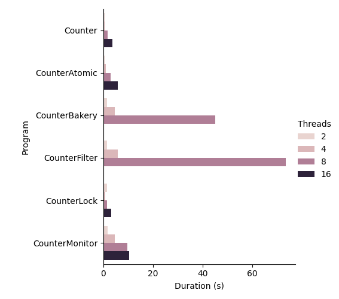

# Exercise 2 — Counters

## Ex 2.1

For the CounterBakery and CounterFilter algorithms, the runtime with 16 threads was too long and so not recorded.

```
┌────────────────┬─────────┬──────────┐
│ Program        ┆ Threads ┆ Duration │
│ ---            ┆ ---     ┆ ---      │
│ str            ┆ i64     ┆ f64      │
╞════════════════╪═════════╪══════════╡
│ Counter        ┆ 2       ┆ 0.3906   │
│ Counter        ┆ 4       ┆ 0.5539   │
│ Counter        ┆ 8       ┆ 1.8143   │
│ Counter        ┆ 16      ┆ 3.5781   │
│ CounterAtomic  ┆ 2       ┆ 0.3995   │
│ CounterAtomic  ┆ 4       ┆ 0.9018   │
│ CounterAtomic  ┆ 8       ┆ 2.8182   │
│ CounterAtomic  ┆ 16      ┆ 5.709    │
│ CounterBakery  ┆ 2       ┆ 1.4331   │
│ CounterBakery  ┆ 4       ┆ 4.681    │
│ CounterBakery  ┆ 8       ┆ 45.115   │
│ CounterFilter  ┆ 2       ┆ 1.412    │
│ CounterFilter  ┆ 4       ┆ 5.823    │
│ CounterFilter  ┆ 8       ┆ 73.661   │
│ CounterLock    ┆ 2       ┆ 1.429    │
│ CounterLock    ┆ 4       ┆ 0.7995   │
│ CounterLock    ┆ 8       ┆ 1.5744   │
│ CounterLock    ┆ 16      ┆ 3.196    │
│ CounterMonitor ┆ 2       ┆ 1.7864   │
│ CounterMonitor ┆ 4       ┆ 4.69     │
│ CounterMonitor ┆ 8       ┆ 9.643    │
│ CounterMonitor ┆ 16      ┆ 10.384   │
└────────────────┴─────────┴──────────┘
```

