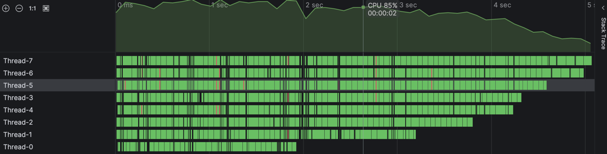
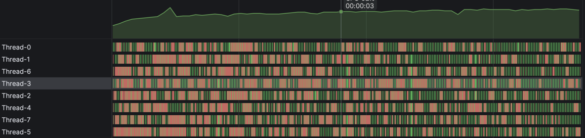
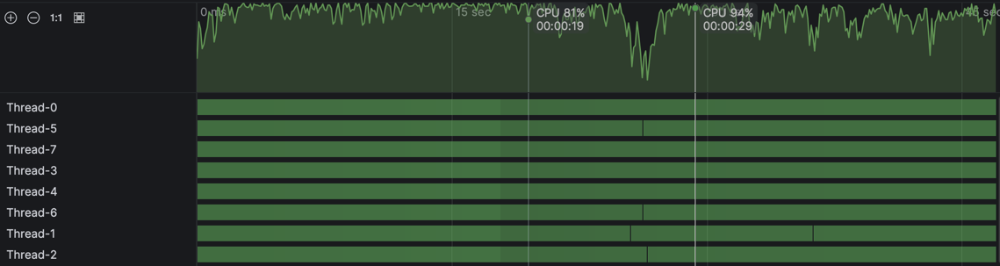

# Primes

## Brute force, with threads

1.) Each thread calculates primes in a range:

```java
static int primeCounter;

@Override
public void run() {
   for (int i = start; i < end; i++) {
       if (isPrime(i)) {
           synchronized (lockPrimes) {
               primeCounter++;
           }
       }
   }
}
```



Computing all primes up to 500'000'000:
- 8 threads
- ~51'000ms

2.) Global counter, threads take a value from the counter and check if prime:

```java
static int counter;
static int primeCounter;

 @Override
 public void run() {
     int num;
     while (counter < count) {
         synchronized (lock) {
             num = counter;
             counter++;
         }
         if (isPrime(num)) {
             synchronized (lockPrimes) {
                 primeCounter++;
             }
         }
     }
 }
```



Computing all primes up to 500'000'000:
- 8 threads
- ~57'000ms

We would expect 2.) to be faster since the load is more balanced (each thread takes the same amount of time to finish).
But in 2.) the threads spend a lot of time waiting.

The solution: use atomic counters.

3.) Global counter, threads take a value from an _atomic_ counter and check if prime:

```java
static AtomicInteger counter = new AtomicInteger(0);
static AtomicInteger primeCounter = new AtomicInteger(0);

 @Override
 public void run() {
     int num;
     while ((num = counter.getAndIncrement()) < count) {
         if (isPrime(num)) {
             primeCounter.getAndIncrement();
         }
     }
 }
```




Computing all primes up to 500'000'000: 
- 8 threads
- ~41'500ms

So, using atomic counter we get 1.39 times faster: atomic operations avoid lock management and OS scheduling overhead.

Note: for solution 1.) use an atomic counter does not make much of a difference.

## Sieve of Erathostenes

Computing all primes up to 500'000'000: 
- 1 thread
- ~5'550ms
